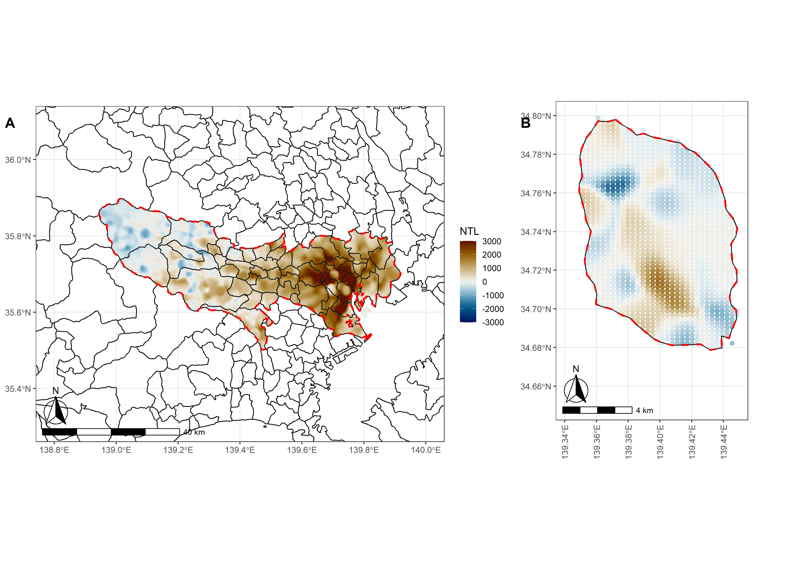
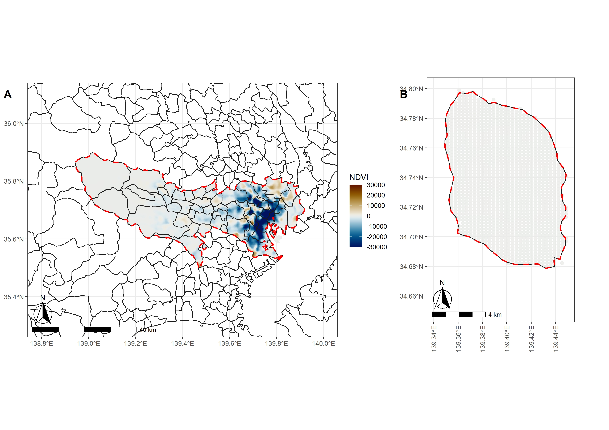
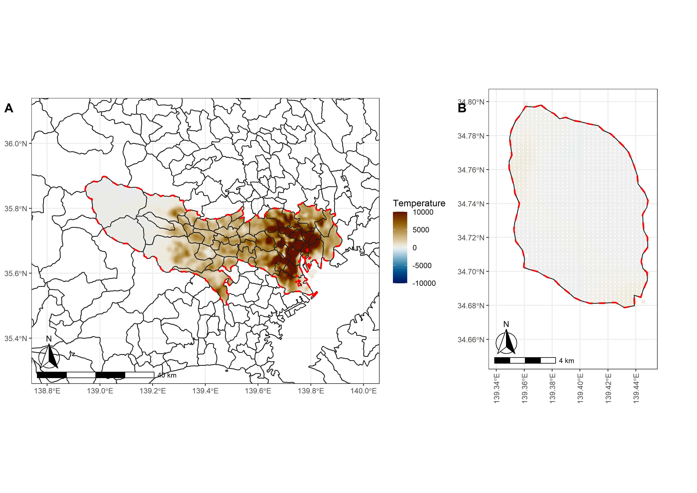
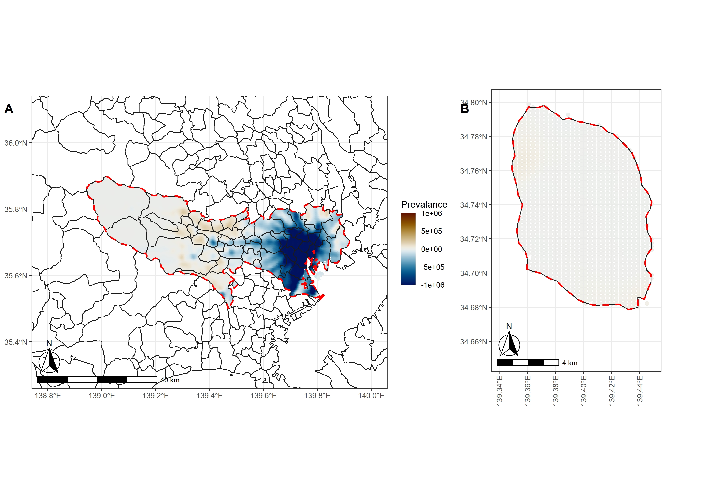
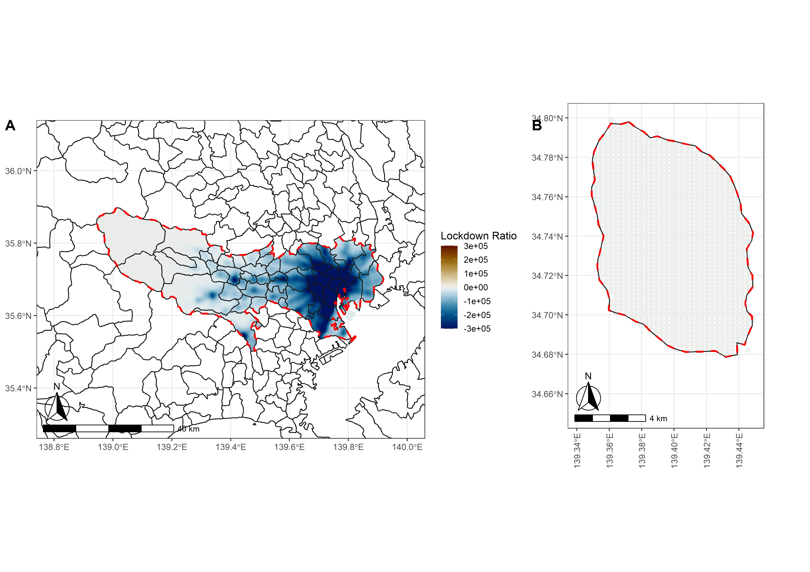

# Spatially Varied Connections between Human Activity and Satellite Observations in Tokyo (DP11)   
This is the repo for the DP11. There should be a relationship between low-speed transportation and satellite data.     
    
Human activity significantly affects urban economics, vitality, and development. Owing to the availability of comprehensive and high-resolution satellite observations, a variety of information of interest is obtained or estimated effectively and efficiently. Satellite observations are generally proxied to represent and probe human activity. However, substantial evidence to support the connections between human activity and satellite data is relatively rare. Here, we use geographically weighted panel regression (GWPR) to examine the relationship between low-speed transportation and several satellite data, including nighttime light (NTL), greenness, temperature, as well as COVID-19-related variables from January 2019 to December 2020. The accuracy of our model is 97.50%, and the model is reliable according to the 10-fold cross-validation. Our result shows that a 1-unit increase in NTL in highly developed areas is associated with more human activity growth. The only increased greenness in the publicly accessible parks could attract more people, while warmer weather consistently increases low-speed transportation. Overall, this research provides solid evidence to connect human activity and satellite data to academia, governments, and societies.    
     
## Author    
Chao Li, Shunsuke Managi    
     
## Result:    
### Spatial Distribution of the NTL Coefficients in GWPR (a: the part of Tokyo on Honshu Island; b: Oshima Machi)    
    
      
### Spatial Distribution of the NDVI Coefficients in GWPR     
    
     
### Spatial Distribution of the Temperature Coefficients in GWPR   
     
     
### Spatial Distribution of the COVID-19 Prevalence Coefficients in GWPR     
     
     
### Spatial Distribution of the COVID-19 Lockdown Ratio Coefficients in GWPR    
   

## R Code

## Data  
OD_data: use the cell phone locations to detect the movements, monthly  
NDVI: MOD13, monthly  
Weather: M*D07, daily  
NTL: VNP46A2 500m, monthly  
WorldPop: 1km, yearly  
  
## Code  
[01_DW_GridRealMovementEstimation_v1.R](00_RCode/01_DW_GridRealMovementEstimation_v1.R): This script is to wash the data to get low speed transportation density from 2019.01 to 2021.01, a total of 25 months of the Great Tokyo Area. 

## Current Platform
Right