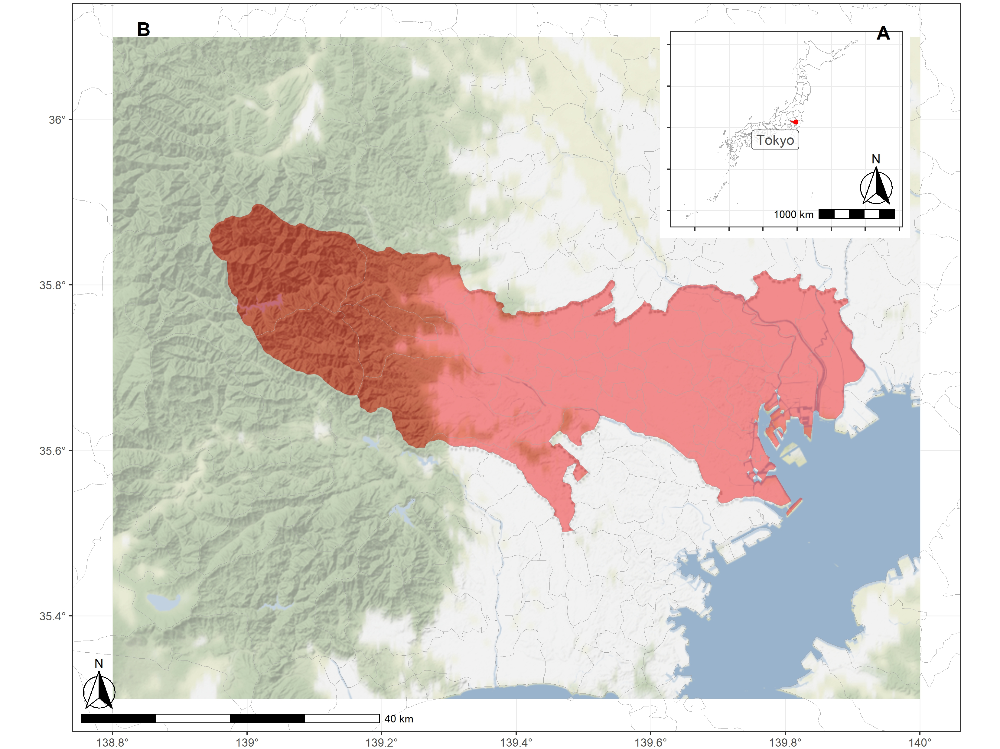
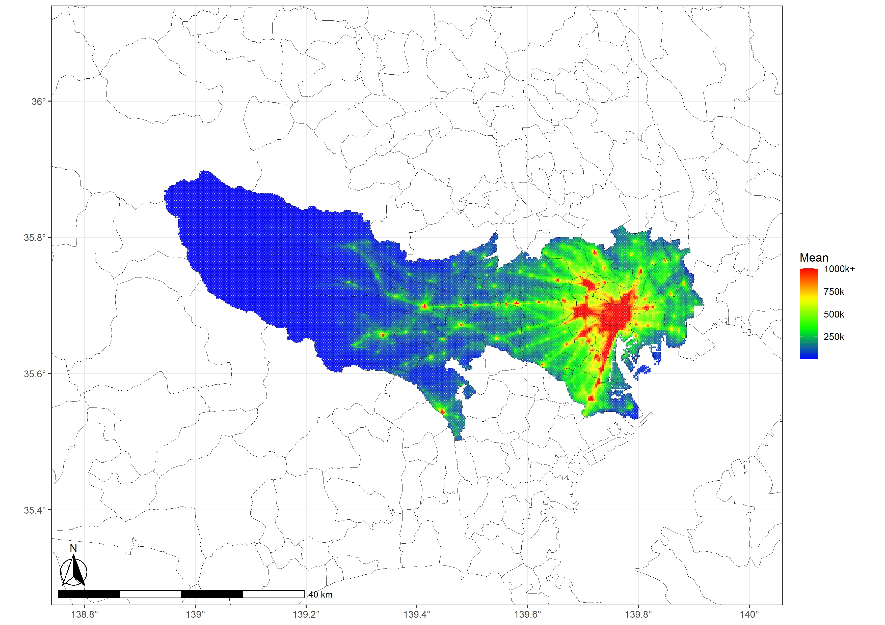

# Human Mobility and Environmental Factors (DP11)   
This is the repo for the DP11. There should be a relationship between low-speed transportation and satellite data.     
    
Human mobility, exemplified by low-speed transportation, profoundly influences urban economics, vibrancy, and progression. With the enlarging climate change impact, a detailed exploration of the interplay between low-speed transportation and environmental elements is crucial yet seldom investigated spatially. Harnessing high-resolution Origin-Destination (OD) data with both spatial and temporal granularity, we construct an exceptionally precise predictive model with 88.29% accuracy. This model unravels the relationship leveraging environmental data from satellite data between January 2019 and December 2020. This study pioneers the use of Shapley additive explanation and geographically weighted panel regression to interpret XGBoost findings and spatial variability in OD data. Our analysis reveals an intriguing dichotomy: urban areas experience a decline in low-speed transportation with rising temperatures, while a positive correlation surfaces in rural regions. Specifically, a 1˚C increase in temperature correlates to a significant reduction of 466,850.8 person ∙time in low-speed transportation in Tokyo, Japan. We also identify that other environmental factors, including air pressure, wind speed, etc., exert spatially varying impacts on low-speed transportation. Altogether, this study furnishes robust empirical evidence of the environmental effects on human mobility, presenting valuable insights for academics, policymakers, and society at large.    
     
## Author    
Chao Li, Alexander Ryota Keeley, Shunsuke Managi    
     
## Result:    
### Study Area and Its Location (a: Tokyo’s location in Japan; b: the part of Tokyo on Honshu Island)         
    
      
### Spatial Distribution of Temporally Average Low-speed Transportation Column              
    
     
### The Distribution Pattern between Independent Variables and Their Shapley Values           
     
     
### The Slopes of the Local Connections based on GWPR            
     
     
     
## Contact Us:    
- Email: Prof. Shunsuke Managi <managi@doc.kyushu-u.ac.jp>  
- Email: Assistant Prof. Alexander Ryota Keeley <keeley.ryota.alexander.416@m.kyushu-u.ac.jp>
- Email: Chao Li <chaoli0394@gmail.com>    
      
## Term of Use:
Authors/funders retain copyright (where applicable) of code on this Github repo. This GitHub repo and its contents herein, including data, link to data source, and analysis code that are intended solely for reproducing the results in the manuscript "Spatially Varied Connections between Human Activity and Satellite Observations in Tokyo". The analyses rely upon publicly available data from multiple sources, that are often updated without advance notice. We hereby disclaim any and all representations and warranties with respect to the site, including accuracy, fitness for use, and merchantability. By using this site, its content, information, and software you agree to assume all risks associated with your use or transfer of information and/or software. You agree to hold the authors harmless from any claims relating to the use of this site.  
